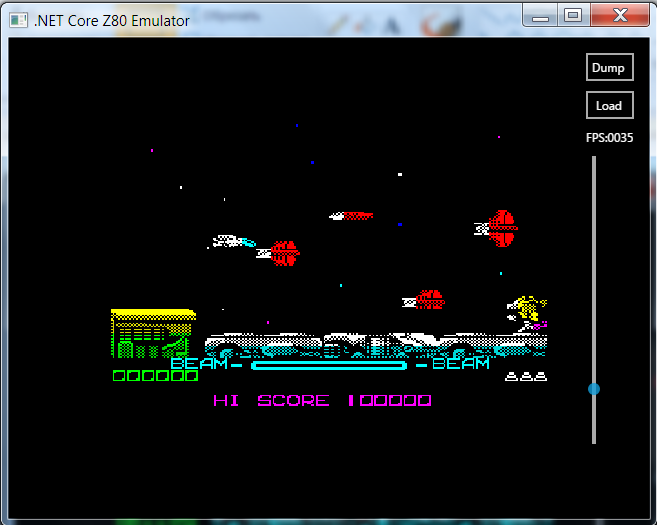
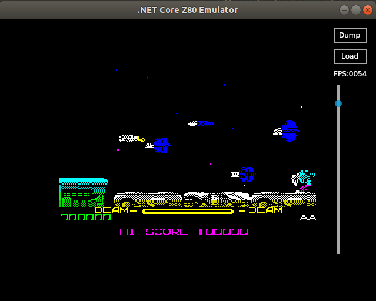

# ZX Spectrum 48K emulator

Simple .net core implementation of Z80 CPU emulator, ULA chip and .Z80 file format reader.
UI is implemented using cross-platform Avalonia library.

## Features:

* Runs both under windows and linux
* Can load and play z80 v1 and v2 format apps
* Processor and ULA emulation not coupled with UI
* Clock cycles are emulated, not affected by real time - supports single-frame stepping.
* Instruction timing according to specs
* Passes zexdoc test
* Custom tests set covering most of instructions
* Capable of running at 1K FPS
* Contains reader of zx spectrum floating point format

## Bugs and limitations:

* Ubuntu version has red and blue color channels swapped, and doesn't react on keydown events (probably caused by avalonia library issues)

* Sound input/output is not supported
* No joystick support
* AF register undocumented bits 3 and 5 behavior is not completely implemented
* Non-maskable interrupts are not supported
* Output tv signal is done line-by-line instead of pixel-by-pixel, so some game effects look invalid
* Contended memory emulation is not implemented
* R register increment is simplified and based only on instruction size

